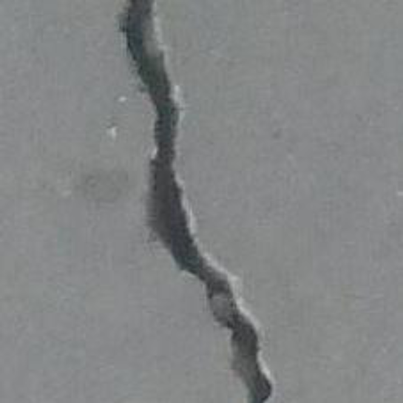

# IAGenerator

     O "IA Generator" é o algoritmo proposto para geração de imagens artificiais. Em resumo, o projeto tem o intuito de realizar o balanceamento de banco de dados através da técnica do Data Augmentation, em português aumento de imagens. De forma mais específica, este projeto tem como objetivo gerar novas imagens, a partir de transformações geométricas e de cor. Isto é, construir um grande banco de imagens a partir de uma pequena quantidade de fotografias originais de rachaduras.

<h1 align="center" display="flex" flexDirection="row">
  
  
</h1>

<h2>Tecnologias utilizadas</h2>
<ul>
    <li>Linguagem R</li>
    <li>IDE: Rstudio</li>
    <li>Biblioteca: EBImage</li>
</ul>
